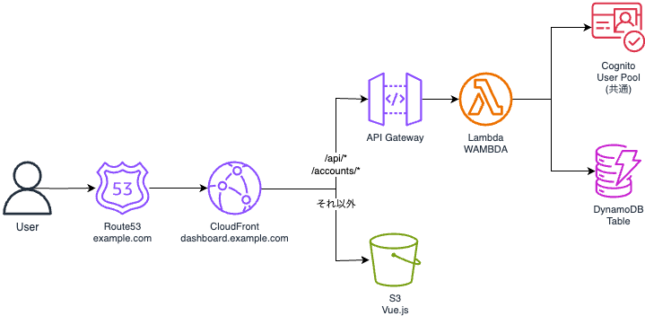

# Finance Project 基本設計書

## 1. プロジェクト概要

Finance Projectは、個人向け財務管理を目的としたWebアプリケーション群です。複数の独立したサブシステムで構成され、各サブシステムは独自のドメイン・インフラを持ちます。すべてのサブシステムは単一のAWSアカウントで管理され、共通の認証基盤を利用します。

**主な特徴:**
- サブシステムごとに独立したドメイン（サブドメイン）
- 共通認証基盤（Cognito）の利用
- 各サブシステムは独立したインフラ構成

## 2. リポジトリ構成

本プロジェクトは以下のコンポーネント（リポジトリ）で構成されます：

### 2.1 FinanceProject_Infra（インフラコンポーネント）
- **役割:** 全サブシステムのインフラをAWS CDKで管理
- **構成:** 単一リポジトリで、common/およびサブシステムごとのスタックで管理
- **詳細:** [infra/README.md](infra/README.md)

### 2.2 FinanceProject_CICD（CI/CDコンポーネント）
- **役割:** CI/CDパイプライン（CodeBuild）の管理
- **構成:** CloudFormationで独立管理
- **詳細:** [cicd/README.md](cicd/README.md)

### 2.3 FinanceDashboardProject_Backend（Backendコンポーネント）
- **役割:** チャート・経済指標ダッシュボードのバックエンド
- **構成:** AWS SAMでLambda + API Gatewayを管理
- **詳細:** [dashboard_backend/README.md](dashboard_backend/README.md)

### 2.4 FinanceDashboardProject_Frontend（Frontendコンポーネント）
- **役割:** チャート・経済指標ダッシュボードのフロントエンド
- **構成:** Vue.js + Bootstrap
- **詳細:** [dashboard_frontend/README.md](dashboard_frontend/README.md)

## 3. AWSアカウント構成

- **アカウント:** 単一AWSアカウントで全サブシステムを統合管理
- **リージョン:** ap-northeast-1（東京）
- **AWSプロファイル:** `finance`

## 4. 共通基盤

### 4.1 共通認証基盤（Cognito）
- **概要:** 全サブシステムで共有する認証基盤
- **配置:** `FinanceProject_Infra/stacks/common/cognito_stack.py`
- **機能:** ユーザー認証、ユーザー情報管理、メールアドレス確認
- **インフラ:** AWS CDK管理
- **保護:** RemovalPolicy.RETAIN（誤削除防止）

## 5. サブシステム一覧

### 5.1 FinanceDashboardProject
- **概要:** チャート・経済指標ダッシュボード
- **ドメイン:** dashboard.example.com（予定）
- **リポジトリ構成:**
  - FinanceDashboardProject_Backend（Backend）
  - FinanceDashboardProject_Frontend（Frontend）
  - FinanceProject_Infra/stacks/dashboard（DynamoDBインフラ）
- **技術スタック:**
  - Backend: WAMBDA / Python 3.13 / AWS SAM
  - Frontend: Vue.js 3.0.4、Vue Router、Bootstrap
- **インフラ:**
  - Lambda + API Gateway（Backend - SAM管理）
  - DynamoDB（CDK管理）
  - S3 + CloudFront（Frontend）
  - CodeBuild（CloudFormation管理）

## 6. 全体アーキテクチャ

**編集可能なファイル**: [finance_architecture.drawio](finance_architecture.drawio)

**補足:**
- Route53ホストゾーンは全サブシステムで共通
- Cognitoは全サブシステムで共有
- DynamoDBはサブシステムごとに独立

## 7. パラメータ管理

プロジェクトの設定値は、AWS Systems Manager Parameter Storeで一元管理されます。

**管理対象:**
- Cognito User Pool情報（User Pool ID、Client ID、Client Secret）
- ACM証明書ARN
- DynamoDB Table名
- S3バケット名
- WAMBDA設定（デバッグモード、認証バイパス、ログレベル等のデプロイ時初期値）

**詳細:** [parameters.md](parameters.md)
